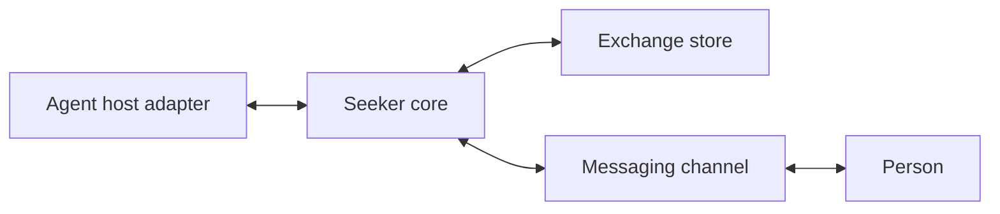

# Architecture

Seeker owns durable attention exchanges. An exchange refers to work already owned by an external manager; it is not a goal, task, or execution database.

The modules run in one application and are wired explicitly. `SeekerCore` creates narrow manager and channel ports. It does not discover plugins, launch agents, interpret permissions with a model, or schedule their work.

## Ownership

| Component | Owns |
| --- | --- |
| Host adapter | Host-authenticated individual manager identity, native input, original human-message verification, and native permissions |
| Core validation and lifecycle | Admission semantics, immutable decisions, reply meaning, corrections, state transitions, and bounded content |
| Delivery pump | Short outbound operations, attempt identity, bounded concurrency, retry hints, and uncertain outcomes |
| Exchange store | Atomic domain operations, source-event deduplication, receiver progress, durable outbox, and one-writer exclusion |
| Messaging channel | Provider-specific rendering and I/O, authentic actor/conversation intake, and its receiver lifecycle |
| Local browser channel | One authenticated localhost inbox reading the same exchange store |

The SQLite implementation calls the core lifecycle functions inside synchronous transactions. Provider and SQL details remain at their implementation boundaries. No network call or human wait occurs inside a transaction. SQLite retains an exclusive connection lock between commits to prevent a second Seeker writer using the same store; this is not an open transaction.

## Decisions and replies

A caller retains its request identity before submitting. The same identity and original decision return the existing exchange; different content fails. Reads do not consume replies.

Every decision revision is immutable. A material change creates a revision and retires its earlier reply handles. An explanation uses a context message and preserves the existing decision. Seeker cannot determine semantic equivalence of arbitrary prose; the manager must put changed targets, effects, scope, options, or conditions in a new revision.

Provider events deduplicate by channel and event identity. Repeated selection of the current declared choice reuses its decision receipt. A different choice, a later return to an earlier choice, a correction, or a stop remains separate. Natural conversation is not deduplicated by text. Corrections require reconciliation instead of silently overwriting the earlier answer.

The core records authenticated replies and their conditions. It never executes an approved effect. The existing action owner must still check scope and conditions at execution.

## Delivery and recovery

Creation and reply intake commit their respective delivery intents atomically. The pump claims short attempts and performs I/O outside storage transactions. A successful adapter response means only that the named endpoint accepted the message. Manager receipt and handling require separate acknowledgments with evidence references.

A restart turns interrupted sends into `unknown`; it does not blindly repeat them. Definite retryable failures respect adapter delay hints and stop after five attempts. The durable reply remains available to its manager even when a push attempt is rejected or uncertain. At most four outbound operations are active, with one per adapter. An adapter must honor cancellation; one that ignores it is quarantined with its single unsettled operation, so healthy adapters can continue and replacement I/O cannot accumulate.

There are no recurring reminders or arbitrary expiry of user authority. No automatic retention job deletes open exchanges, receipts, or relied-on decisions. Resource limits reject new work explicitly. See [local operations](local.md) for availability and recovery limits.
